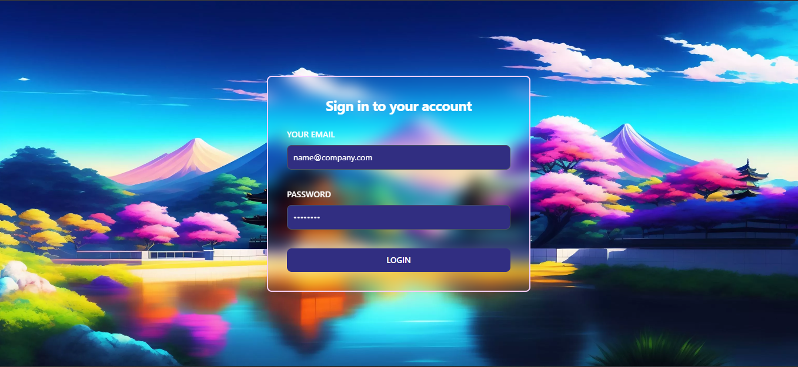
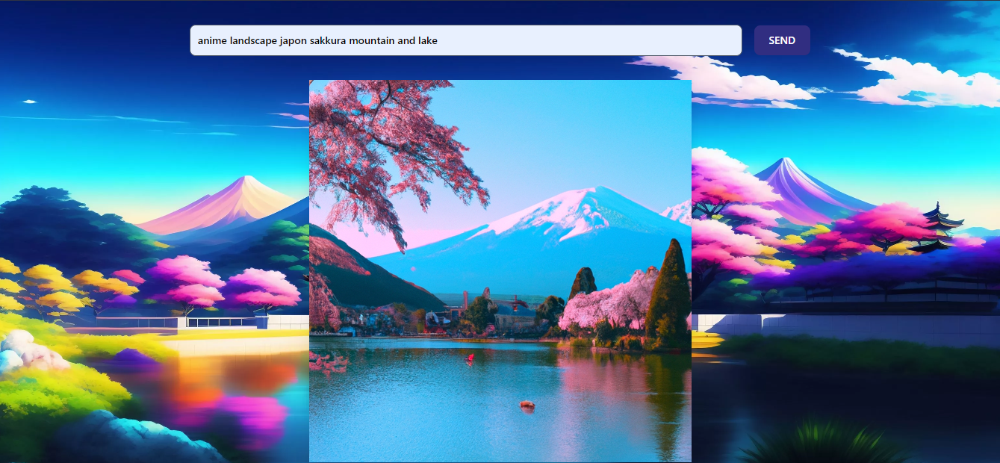

 

  <h3 align="center">Image Generator Client</h3>

  

    Image Generator Client using React & Json Web Token
     
     
    <a href="https://github.com/manesjonathan/image-generator-client/issues">Report Bug</a>
    .
    <a href="https://github.com/manesjonathan/image-generator-client/issues">Request Feature</a>
  

    

## About The Project

See [Image Generator repository](https://github.com/manesjonathan/image-generator)

## Contributing

Contributions are what make the open source community such an amazing place to be learn, inspire, and create. Any contributions you make are **greatly appreciated**.
* If you have suggestions for adding or removing projects, feel free to [open an issue](https://github.com/manesjonathan/image-generator/issues/new) to discuss it.
* Please make sure you check your spelling and grammar.
* Create individual PR for each suggestion.

### Creating A Pull Request

1. Fork the Project
2. Create your Feature Branch (`git checkout -b feature/AmazingFeature`)
3. Commit your Changes (`git commit -m 'Add some AmazingFeature'`)
4. Push to the Branch (`git push origin feature/AmazingFeature`)
5. Open a Pull Request

## License

Distributed under the MIT License. See [LICENSE](https://github.com/manesjonathan/image-generator/blob/main/LICENSE.md) for more information.

## Authors

* [Jonathan Manes](https://github.com/manesjonathan/) - *Full Stack Developer*
